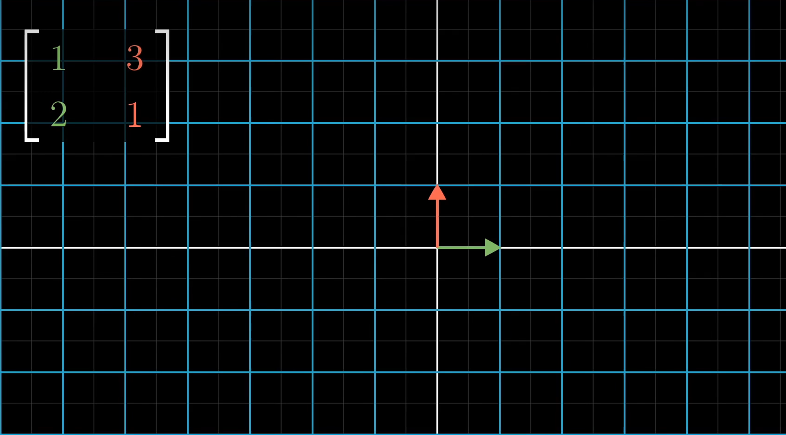
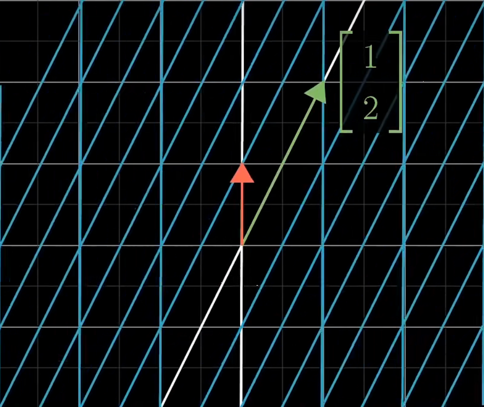
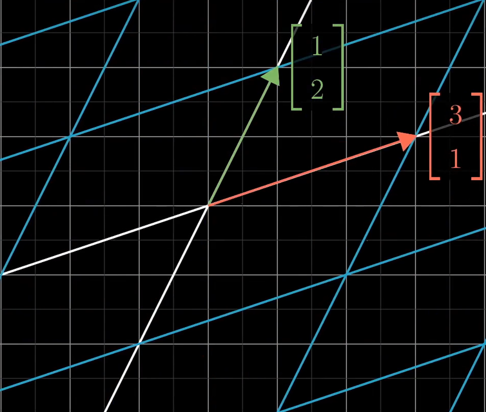
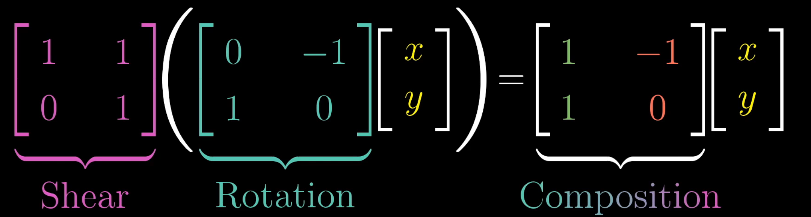
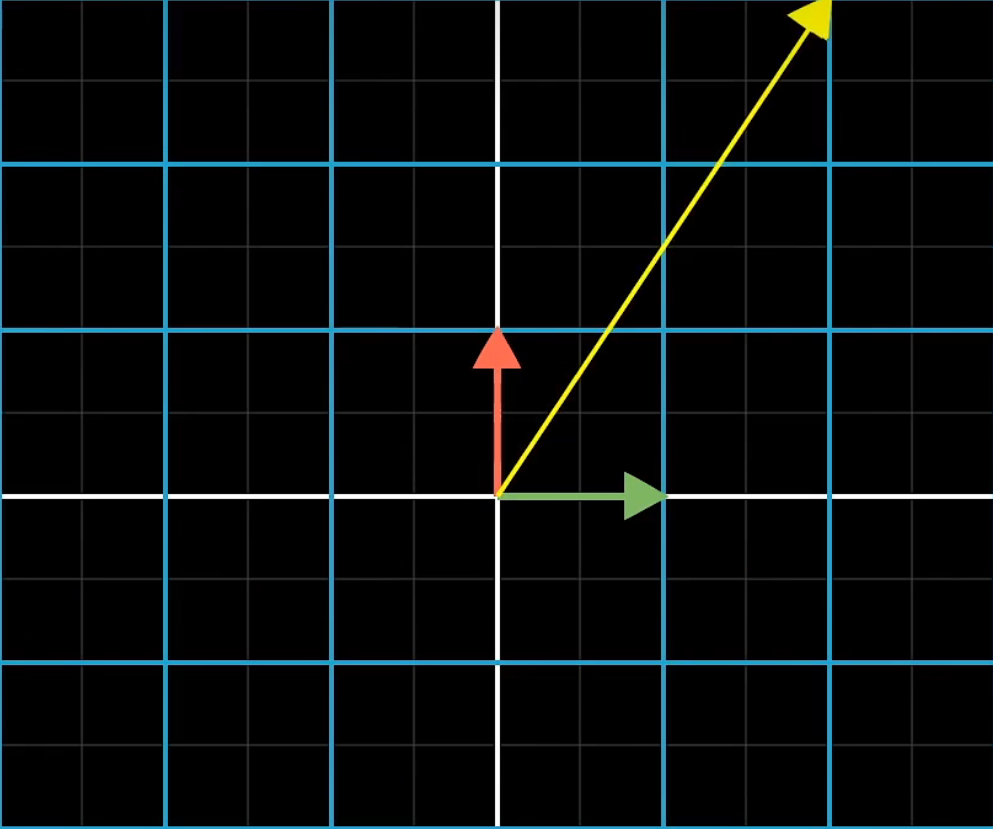
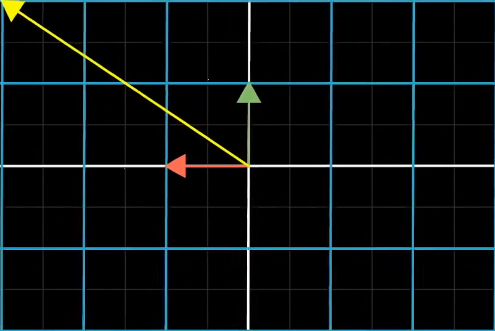
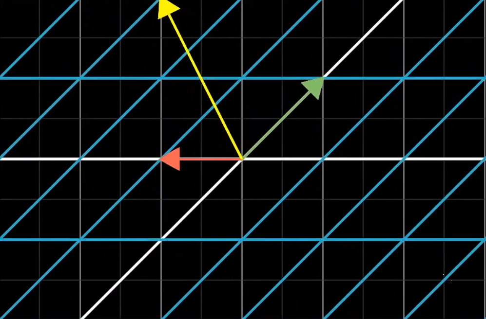
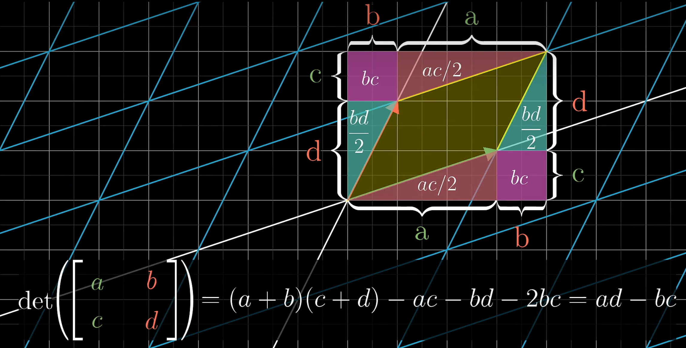

# Linear Algebera

## Basic

* The **span**(空间) of the given set of vectors is the set of all their **linear combination** 
* Linear dependent vs independent
  * If at least one of the vectors does not adding any dimension to the span since it is already in the span,  the set of vectors is **linear dependent**
  * If each vector really does add another dimension to the span,  the set of vectors is **linear independent**
* The **basis**(基) of a vector space is a set of linear independent vectors that span the full space
* **Linear transformation**
  * Lines remain lines (parallel and evenly(均匀地) spaced(等距的))
  * Origin remains fixed

## Linear Transformation

### Matrix

[https://www.bilibili.com/video/BV1ys411472E/?p=4&spm_id_from=333.880.my_history.page.click&vd_source=42f65d88ec975d7a5daf32d8a0bea61b](https://www.bilibili.com/video/BV1ys411472E/?p=4&spm_id_from=333.880.my_history.page.click&vd_source=42f65d88ec975d7a5daf32d8a0bea61b)

Matrices where the columns represent the coodinates give us a language to describe linear transformation

*** Every time you see a matrix, you can interpreted it as a certain transformation of space***

$$\begin{bmatrix} a & b \\ c & d \end{bmatrix}\begin{bmatrix} x \\ y \end{bmatrix} = x \begin{bmatrix} a \\ c \end{bmatrix} + y \begin{bmatrix} b \\ d \end{bmatrix} = \begin{bmatrix} xa + yb \\ xc + yd \end{bmatrix}$$

* $\begin{bmatrix} a \\ c \end{bmatrix}$ and $ \begin{bmatrix} b \\ d \end{bmatrix}$ are the new coodinates that describe the linear transformation of $\begin{bmatrix} 1 \\ 0 \end{bmatrix}$ and $\begin{bmatrix} 0 \\ 1 \end{bmatrix}$
* Then $\begin{bmatrix} x \\ y \end{bmatrix}$ is transformed into $\begin{bmatrix} xa + yb \\ xc + yd \end{bmatrix}$ with the new coodinates

    

    

### Matrix-matrix Multiplication

**Matrix-matrix multiplication** has the geometric meaning of **applying one transformation then another**

The new linear transformation can be called the "composition" of the seperated tansformation

    

> note: the transformations should be read from right to left, just like f(g(x))

The new linear transformation can be counted as the left linear transformation of the right transformation's coordinates

$$\begin{bmatrix} a & b \\ c & d \end{bmatrix}\begin{bmatrix} e & f \\ g & h \end{bmatrix} =  = \begin{bmatrix} ae + bg & bf + dh \\ ce + dg & cf + dh \end{bmatrix}$$

### Determinant(行列式), Rank(秩)

The **determinant** can **measure the scaling ratio of area(or volumn or space) increase or decrease, or the area(or volumn or size) of the unit spuare(or cube or space)**.

**The sign of the determinant represents the orientation(定向) of space**. If the orientation is inverted(or the relative position of the coordinates is changed), the sign of the determinant will flip.  

If **the determinant of a matrix is 0**, the transformation associated to the matrix would **squish the space into a smaller dimension **$\longrightarrow$ the column vectors of the matrix are linear dependent

And **the number of dimensions in the transformed space** is called the **"rank" **of the associated matrix

### Linear system of equations(线性方程组)

**Linear system of equations**($A\vec{x} = \vec{v}$) can be regarded as **a method to find the origin vector($\vec{x}$) of a transformed vector($\vec{v}$) through a specific transformation($A$)**

To find $\vec{x}$, we can first find the inverse(逆) of $A$ that transform $\vec{v}$ into $\vec{x}$ in reverse, denoted as $A^{-1}$

* If $det(A) \ne 0$(the transformation does not squash the space into a lower dimension), there will always be one and only one $\vec{x}$ that can be transformed into $\vec{v}$, it can be counted through $\vec{x} = A^{-1}\vec{v}$
* If $det(A) = 0$, 
