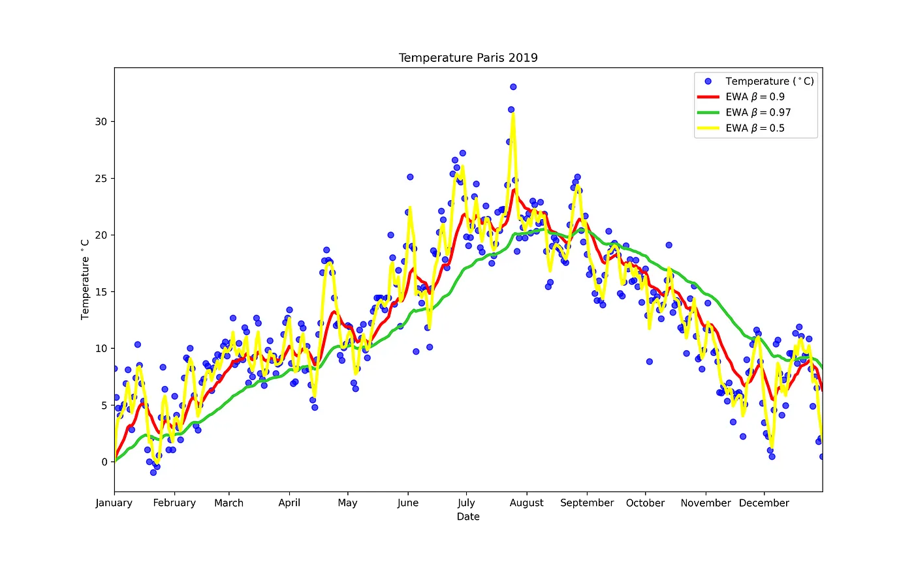

# Basic

- [Loss Function](#loss-function)
  - [Classification](#classification)
    - [Cross-entropy / Log-Loss](#cross-entropy--log-loss)
  - [Regression](#regression)
    - [Mean Square Error / Quadratic Loss / L2 Loss](#mean-square-error--quadratic-loss--l2-loss)
  - [Ranking](#ranking)
    - [Bayesian Personalized Ranking(BPR)](#bayesian-personalized-rankingbpr)
- [Optimizer algorithm](#optimizer-algorithm)
  - [Minibatch Stochastic Gradient Descent](#minibatch-stochastic-gradient-descent)
  - [Adam Optimizer](#adam-optimizer)
- [降低过拟合](#降低过拟合)
  - [Drop out](#drop-out)

## [Loss Function](https://towardsdatascience.com/what-is-loss-function-1e2605aeb904)

The loss function is the function that **computes the distance between the current output of the algorithm and the expected output**

The loss function can be chosen both via some practical considerations and **maximum likelihood estimation**

> **似然函数** L(b|A) 的目的为找到产生既定样本 A 的条件 ^b。因此，当 b 越接近 ^b，即越有可能产生 A 时，L 应当越大。
> L(b|A) 符合条件概率 P(A=a|B=b) 的特点，设 L(b|A) 为 $\alpha$P(A=a|B=b)
> 注意：似然函数的具体值没有意义，只有大小比较具有意义

### Classification

Before optimize the loss function, wo could use the **softmax function** to transform the outputs of an ordinary neural network layer into valid discrete probability distributions.

> Softmax function: \[\hat{\mathbf{y}} = \mathrm{softmax}(\mathbf{o}) \quad \text{where}\quad \hat{y}_i = \frac{\exp(o_i)}{\sum_j \exp(o_j)}.\] The conditional class probability increases with increasing \(o_i\). It is monotonic. All probabilities are nonnegative and they add up to \(1\) by dividing each by their sum. 

#### Cross-entropy / Log-Loss

$Y$ denotes the set of instances belong to the class, and $Y−$ denotes the set of negative instances

$y_i$ denotes to whether the instance belonging to the class

$\hat y_i$ denotes to the probability of the instance belonging to the class

Likelihood function: \[P(Y,Y-|\theta) = \prod_{i\in Y}{\hat y_i}\prod_{i \in Y-}{(1- \hat y_i)}\]

Loss function: \[L = - \sum_{i \in Y}{\log \hat y_i} - \sum_{i \in Y-}{\log (1- \hat y_i)}\]\[ = - \sum_i{y_i \log \hat y_i + (1-y_i)log (1 - \hat y_i)} \]

When the number of classes is more than 2, the loss function can be simplified:\[L = - \sum_i{y_i \log \hat y_i} \]

### Regression 

#### Mean Square Error / Quadratic Loss / L2 Loss

Assuming the noise is normally distributed as gaussian noise:

\[y = \hat y + \epsilon \text{ where } \epsilon \sim \mathcal{N}(0, \sigma^2).\]

Likelihood function:

\[P(y \mid \theta) = \frac{1}{\sqrt{2 \pi \sigma^2}} \exp\left(-\frac{1}{2 \sigma^2} (y - \hat y)^2\right).\]

Loss function:

\[L = \frac{1}{2}\sum_i{(y_i - \hat y_i)^2}\]

### Ranking

#### [Bayesian Personalized Ranking(BPR)](https://towardsdatascience.com/recommender-system-bayesian-personalized-ranking-from-implicit-feedback-78684bfcddf6) 

## Optimizer algorithm

### [Minibatch Stochastic Gradient Descent](https://towardsdatascience.com/batch-mini-batch-stochastic-gradient-descent-7a62ecba642a)

Rather than taking a full batch or only a single sample at a time, we **take a minibatch of observations** . The number of minibatch is preferably a multiple of a large power of \(2\). This leads us to **minibatch stochastic gradient descent**.

In each iteration \(t\) 
1. We first **randomly sample a minibatch \(\mathcal{B}_t\)** consisting of a fixed number \(|\mathcal{B}|\) of training examples. 
2. We then **compute the derivative (gradient) of the average loss** on the minibatch with respect to the model parameters. 
3. We **multiply the gradient by a predetermined small positive value \(\eta\), called the learning rate**, and subtract the resulting term from the current parameter values. We can express the update as follows:

\[(\theta_1, \theta_2, ...) \leftarrow (\theta_1, \theta_2, ...) - \frac{\eta}{|\mathcal{B}|} \sum_{i \in \mathcal{B}_t} \partial_{(\theta_1, \theta_2, ...)} l^{(i)}(\theta_1, \theta_2, ...).\]

### [Adam Optimizer](https://www.geeksforgeeks.org/intuition-of-adam-optimizer/)

> **[Exponentially Weighted Average(EWA)](https://medium.com/mlearning-ai/exponentially-weighted-average-5eed00181a09)**
>The Exponentially Weighted Moving Average (EWMA) is commonly used as a **smoothing** technique in time series 
> \[W_t = \beta W_{t-1} + (1-\beta) \theta_t\] \(\beta\) is the weight parameter deciding how important the current observation is in the calculation of the EWA, \(W_t\) is the EWA for day t, \(\theta_t\) is the value for day t
> If we expand \(W_t\), we have:\[W_t = (1 - \beta)(\theta_t + \beta \theta_{t-1} + ... + \beta^{t-1} \theta_1)\] \[ = (1-\beta)(\beta^0, \beta^1, ..., \beta^{t-1})·(\theta_t, \theta_{t-1}, ..., \theta_1)\] \((\beta^0, \beta^1, ..., \beta^{t-1})\) is called the exponential weight
> The bigger \(\beta\) makes the curve smoother and less noisy

## 降低过拟合

### Drop out

1. 相当于一次捕捉某一样本未被抛弃的特征维度限制下的一片样本空间的数据，每 drop out 一次相当于在这片数据种继续增加限制维度，一次训练的样本空间更小

但未使用 drop out 相当于一次只捕捉一个样本数据，非常容易过拟合

2. 相当于依次只看到样本的一部分，每次 drop out 不断补全对于样本的认知，降低了对于该样本的拟合程度

未使用 drop out 相当于可以直接看到样本的全部，非常容易过拟合

