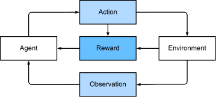

# Introduction

- [Key components](#key-components)
- [Kinds of machine learning problems](#kinds-of-machine-learning-problems)
  - [Supervised learning](#supervised-learning)
  - [Unsupervised and Self-Supervised Learning](#unsupervised-and-self-supervised-learning)
  - [Reinforcement Learning](#reinforcement-learning)

## Key components

* the **data** we can learn from
* the **model** of how to transform the data
* an **objective function(loss function)** that qualifies how well the model is doing
* an **algorithm** to adjust the model's parameter to optimize the objective function

## Kinds of machine learning problems

### Supervised learning

Supervised learning describes tasks where we are **given a dataset containing both features and labels and tasked** with producing a model to predict the labels given input features. 

* Regression
* Classification
* Tagging
* Search
* Recommender Systems
* Sequence Learning

### Unsupervised and Self-Supervised Learning

Unsupervised learning describes tasks where we are **given a giant dump of data with no detailed target**

* Clustering
* Principal component analysis
* Causality and probabilistic graphical models
* Generative adversarial networks

### Reinforcement Learning

Reinforcement learning gives a very general statement of a problem, in which an agent **interacts with an environment over a series of time steps**. At each time step, the agent receives some observation from the environment and must choose an action that is subsequently transmitted back to the environment via some mechanism (sometimes called an actuator). Finally, the agent receives a reward from the environment. 

