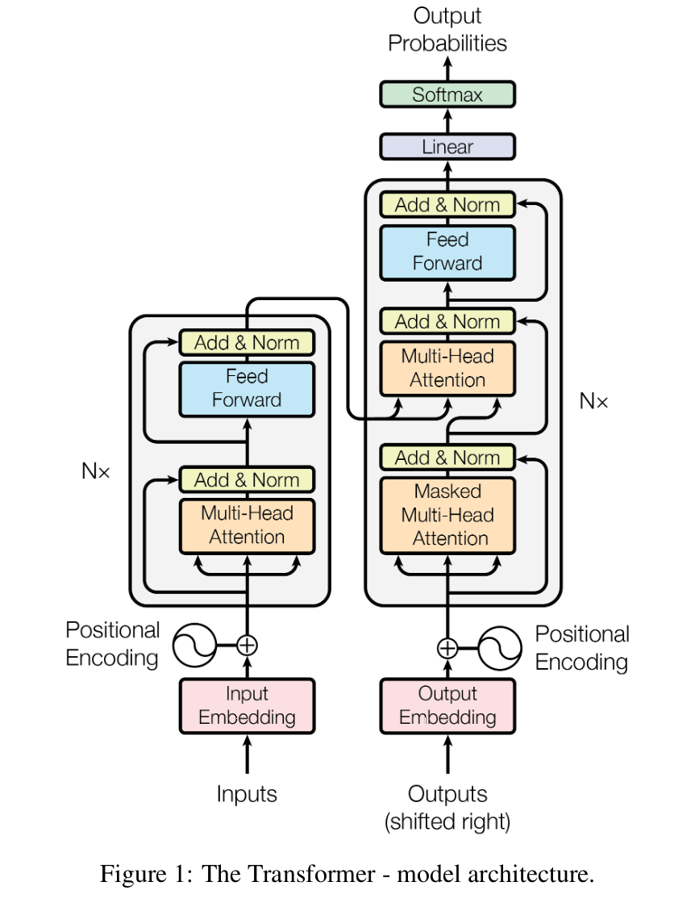
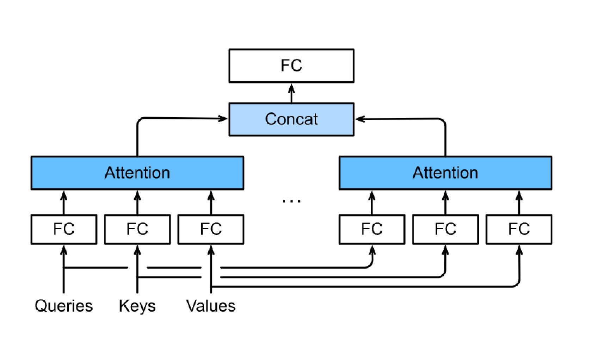
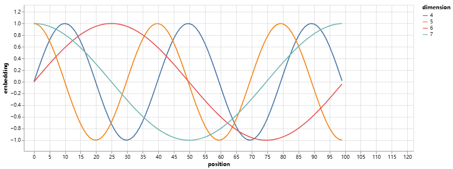

# Attention is All You Need

[http://nlp.seas.harvard.edu/annotated-transformer/](http://nlp.seas.harvard.edu/annotated-transformer/)

[TOC]

## Introduction

The Transformer is based solely on attention mechanisms, dispensing with recurrence and convolutions entirely.

The Transformer allows for significantly more parallelization and can reach a new state of the art in translation quality.

## Model Architechture

### Multi-Head Attention

To allows the model to jointly attend to information from different representation subspaces at different positions.

* Instead of performing a single attention pooling, queries, keys, and values can be transformed with ℎ independently learned linear projections. 
* Then these ℎ projected queries, keys, and values are fed into attention pooling in parallel. 
* In the end, ℎ attention pooling outputs are concatenated and transformed with another learned linear projection to produce the final output.

$MultiHead(Q,K,V)=Concat(head_1 ,...,head_h)W^O$

$head_i =Attention(QW_i^Q ,KW_i^K ,VW_i^V )$

Where the projections are parameter matrices $W_i^Q \in R^{d \times d_q}$, $W_i^K \in R^{d \times d_k}$,$W_i^V \in R^{d \times d_v}$, $W_i^O \in R^{hd_v \times d}$. 

**$d_q, d_k, d_v$ should be less then $d$. In this way,  the $Q, K, V$ would be transformed into a lower-demension space with [the function of MLP](./../../Basic%20Model/MLP.md#function) to capture information from different representation subspaces.**

To avoid significant growth of computational cost and parametrization cost, we set $d_q = d_k = d_v = d / h$. The total computational cost is similar to that of single-head attention with full dimensionality.

### Self-Attention

$$y_i=f(x_i, (x_1,x_1),(x_2,x_2),...,(x_n,x_n))$$

|                                                              | Self-attention | CNN        | RNN       |
| ------------------------------------------------------------ | -------------- | ---------- | --------- |
| Computational Complexity                                     | $O(n^2d)$      | $O(knd^2)$ | $O(nd^2)$ |
| Sequential Operations                                        | $O(1)$         | $O(1)$     | $O(n)$    |
| Maximum Path Length (the number of layers needed to aggregate the information of token pair with longest distance) | $O(1)$         | $O(n/k)$   | $O(n)$    |

**A shorter path between any combination of sequence positions makes it easier to learn long-range dependencies within the sequence**

### Applications of Attention in Model

1) In **encoder-decoder attention** layers, the queries come from the previous decoder layer, and the memory keys and values come from the output of the encoder. This allows every position in the decoder to attend over all positions in the input sequence.
2) In the encoder's self-attention layer, all of the keys, values and queries come from the output of the previous layer in the encoder. 
3) In the decoder's **masked self-attention** layer,  during prediction the output sequence is generated token by token; thus, at any decoder time step only the generated tokens can be used in the decoder self-attention. We need to prevent leftward information flow in the decoder to preserve the auto-regressive property. We implement this inside of scaled dot-product attention by **masking out (setting to $-\infin$) all values in the input of the softmax which correspond to illegal connections**.

### Positoinal encoding

In order for the model to make use of the order of the sequence, we add “positional encodings” to the input embeddings at the bottoms of the encoder and decoder stacks.

Just like the binary representations(000, 001, 010, 011, 100, 101, 110, 111), a higher bit has a lower frequency than a lower bit. We can use the sine and cosine functions of different frequencies to represent positions

$$PE_{(pos, 2i)}=sin(pos/10000^{2i/d})$$

$$PE_{(pos, 2i+1)}=cos(pos/10000^{2i/d})$$

where $pos$ is the position and $i$ is the dimension.

To see more about the position encodings, look at [position encodings](BERT:%20Pre-training%20of%20Deep%20Bidirectional%20Transformers%20for%20Language%20Understanding.md#position-encoding).

### Positionwise Feed-Forward Networks

The representation at all the sequence positions using the same MLP. This is why we call it positionwise.

### Residual Connection and Layer Normalization

The “add & norm” component is a residual connection immediately followed by layer normalization.

Since the inputs are often variable-length sequences, we often use layer norm rather than batch norm to enjoy benefits of scale independence and batch size independence.

### Embeddings and Softmax

We use learned embeddings to convert the input tokens and output tokens to vectors of dimension $d$.

 We also use the usual learned linear transformation and softmax function to convert the decoder output to predicted next-token probabilities.

To see more about the embeddings, look at [Input Embeddings](BERT:%20Pre-training%20of%20Deep%20Bidirectional%20Transformers%20for%20Language%20Understanding.md#input-embedding).

## Inspiration

* Multi-Head Attention is just like the multi-channel convolution to caputure imformation from different representation subspaces.
* The training process should match the prediction process, like the masked self attention.
* Properly utilizing fully connected (FC) to linear transform or nonlinear transform the feature space.

