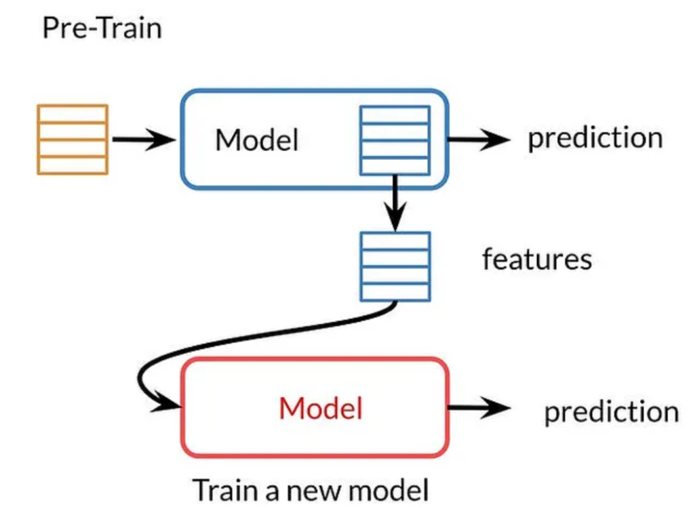
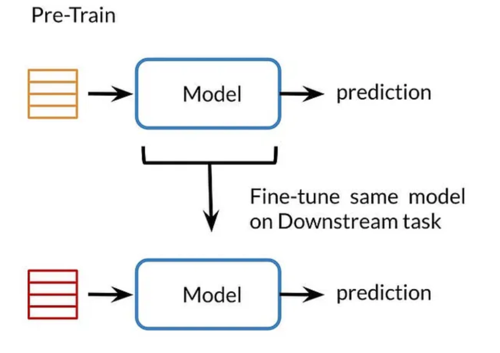

# Basic

## Pre-training

"Pre-trained" refers to a model that has been trained on a large dataset or a specific task before being made available for further use.

## Transfer Learning

Transfer learning, used in machine learning, is the reuse of a pre-trained model on a new problem. 

The general idea is to use the knowledge a model has learned from a task with a lot of available labeled training data in a new task that doesn't have much data. Instead of starting the learning process from scratch, we start with patterns learned from solving a related task.

For example, in training a classifier to predict whether an image contains food, you could use the knowledge it gained during training to recognize drinks.

### Feature-based

 In feature-based transfer learning, the idea is to use the pre-trained weights of a model trained on a large dataset as a feature extractor. Instead of using the entire pre-trained model, only the learned features from one or more layers are extracted. These features can then be used as input to a new model or classifier, which is trained on a smaller dataset specific to the target task.

The process typically involves freezing the pre-trained model's weights and training only the new classifier on the target dataset. By using the pre-trained model's learned features as input, the new model benefits from the generalization and feature representation capabilities of the pre-trained model.

### Fine-tuning

Fine-tuning is another transfer learning approach where the pre-trained model's weights are used as an initialization for training on a new task. Unlike feature-based transfer learning, fine-tuning involves updating the weights of the entire pre-trained model, including the initial layers, during the training process. This allows the model to adapt and learn task-specific features while still leveraging the knowledge learned from the pre-training.

The fine-tuning process typically involves replacing the last few layers of the pre-trained model with new layers that match the number of target classes or the desired output. The model is then trained on the target dataset, starting with the pre-trained weights as initialization. 

### Zero-shot Learning

### Few-shot Learning