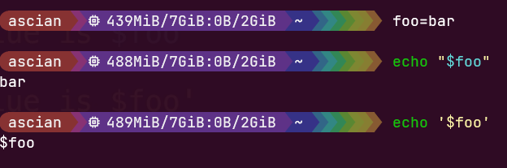

# Shell

- [Basic](#basic)
- [Stream](#stream)
- [Variable](#variable)
- [String](#string)
- [Function](#function)
- [Process Control](#process-control)
- [Script](#script)

## Basic

#### Common

| name      | usage                                                  |
| --------- | ------------------------------------------------------ |
| `alias`   | Define or display aliases                              |
| `cd`      | 修改当前工作目录                                       |
| `chmod`   | 控制用户对文件的操作权限                               |
| `clear`   | 清屏                                                   |
| `cp`      | 复制文件                                               |
| `date`    | 显示时间                                               |
| `env`     | 显示系统中已存在的环境变量，以及在定义的环境中执行指令 |
| `history` | 命令行历史记录                                         |
| `ln`      | Creates links to files and directories                 |
| `ls`      | 显示目录下所有文件, powershell下包含查找功能           |
| `mkdir`   | 创建目录                                               |
| `pwd`     | 显示工作目录名                                         |
| `rm`      | 删除文件                                               |
| `rmdir`   | 删除目录                                               |
| `which`   | 获取命令程序存储位置                                   |

#### Manager

| name      | usage                                                                                                                            |
| --------- | -------------------------------------------------------------------------------------------------------------------------------- |
| `apt`     | Package management system, enables some options better suited for interactive usage by default compared to apt-get and apt-cache |
| `chezmoi` | A multi-machine dotfile manager                                                                                                  |
| `conda`   | Package, dependency and environment management for any programming language                                                      |
| `docker`  | Manage Docker containers and images                                                                                              |
| `npm`     | Node.js默认包管理器                                                                                                              |

#### System

| name       | usage                                                                                                                          |
| ---------- | ------------------------------------------------------------------------------------------------------------------------------ |
| `free`     | Display amount of free and used memory in the system                                                                           |
| `passwd`   | Change user password                                                                                                           |
| `ps`       | Report a snapshot of the current processes                                                                                     |
| `top`      | Display  system  summary  information  as  well  as a list of processes or threads currently being managed by the Linux kernel |
| `tty`      | Print the file name of the terminal connected                                                                                  |
| `uptime`   | Tell how long the system has been running                                                                                      |
| `vmstat`   | Reports information about processes, memory, paging, block IO, traps, disks and cpu activity                                   |
| `who`      | Show who is logged on                                                                                                          |
| `whoami`   | Print  the  user  name  associated with the current effective user ID                                                          |
| `wslfetch` | A WSL Screenshot Information Tool to print information in a elegant way                                                        |
| `wslsys`   | A WSL system information printer to print out some basic system information                                                    |
| `wslact`   | A set of quick actions for WSL such as creating startup tasks and manually sync time between Windows and WSL                   |

#### Job Control

| command        | description                                                                          |
| -------------- | ------------------------------------------------------------------------------------ |
| `bg`           | Run or continue jobs in background                                                   |
| `fg`           | Run or continue jobs in foreground                                                   |
| `jobs`         | Viewing information about processes spawned by the current shell                     |
| `kill`         | Send a signal to a process                                                           |
| `nohub`        | Run a command immune to hangups                                                      |
| `sleep`        | Delay for a specified amount of time                                                 |
| `test` 或 `[]` | 用于测试条件，返回`true`或`false`                                                    |
| `time`         | Run programs and summarize system resource usage                                     |
| `tmux`         | Terminal multiplexer                                                                 |
| `wslgsu`       | This tool allows you to generate a WSL startup Task using the Windows Task Scheduler |
#### Network

| name   | usage                                                                                      |
| ------ | ------------------------------------------------------------------------------------------ |
| `curl` | 利用URL规则的文件传输(上传和下载)工具                                                      |
| `scp`  | Scp copies files between hosts on a network                                                |
| `ssh`  | a program for logging into a remote machine and for executing commands on a remote machine |
| `wget` | 使用HTTP、HTTPS或FTP协议的网页下载工具                                                     |

#### Check

| name       | usage                                              |
| ---------- | -------------------------------------------------- |
| `bat`      | Better alternative of `cat` and `less`             |
| `broot`    | 交互式文件树                                       |
| `cat`      | Concatenate files and print on the standard output |
| `head`     | Output the first part of files                     |
| `tail`     | Output the last part of files                      |
| `xdg-open` | 根据文件类型自动调用对应默认打开程序               |

#### Find

| name     | usage                      |
| -------- | -------------------------- |
| `fd`     | `find` 更好替代            |
| `find`   | 在指定目录下查找文件       |
| `fzf`    | 模糊搜索文件或输入文本     |
| `grep`   | 查找文件里符合条件的字符串 |
| `locate` | 快速查找文件名             |
| `rg`     | `gerp` 更好替代            |

#### Other Tools

| name         | usage                                                                                                                                                                 |
| ------------ | --------------------------------------------------------------------------------------------------------------------------------------------------------------------- |
| `bc`         | An arbitrary precision calculator language                                                                                                                            |
| `diff`       | 逐行比较文件差异                                                                                                                                                      |
| `echo`       | 输出内容                                                                                                                                                              |
| `man`        | 获取指令使用方法                                                                                                                                                      |
| `od`         | Dump files in octal and other formats                                                                                                                                 |
| `shellcheck` | 检查 .sh 文件语法错误                                                                                                                                                 |
| `sort`       | Sort lines of text files                                                                                                                                              |
| `tar`        | An archiving program designed to store multiple files in a single file (an archive), and to  manipulate such  archives                                                |
| `tee`        | Read from standard input and write to standard output and files                                                                                                       |
| `tldr`       | 社区驱动的简化版`man`页面, 提供了简明易懂的命令重要信息和用法示例摘要                                                                                                 |
| `touch`      | 用于修改文件或者目录的时间属性，若文件不存在，用于创建新文件                                                                                                          |
| `tr`         | Replace,  squeeze,  and/or  delete  characters  from standard input, writing to standard output                                                                       |
| `uniq`       | Report or omit repeated lines                                                                                                                                         |
| `wc`         | Print line, word, and byte counts for each file                                                                                                                       |
| `wslupath`   | A WSL Windows path Converter that can convert Windows path to other styles of path                                                                                    |
| `wslusc`     | A WSL shortcut creator to create shortcut on Windows Desktop                                                                                                          |
| `wslvar`     | A WSL tool to help you get Windows system environment variables                                                                                                       |
| `wslview`    | A file viewer on WSL that allows you to open files and folders from WSL in Windows and a fake web browser that allows opening urls in your default browser on Windows |
| `7z`         | A file archiver with high compression ratio format                                                                                                                    |

#### Windows

| name                  | usage                              |
| --------------------- | ---------------------------------- |
| `fe`                  | 使用`fzf` 打开文件并编辑           |
| `fgs`                 | 使用`fzf` 打开 git status          |
| `fs`                  | 使用`fzf` 打开scoop                |
| `Invoke-PsFzfRipgrep` | 同时使用`fzf`和`ripgrep`搜索字符串 |

##### shortcuts
#### 保留变量

* $0 表示脚本名字
* $1~9 表示第 1 个到第 9 个参数
* $# 表示给定的参数个数
* $@ 表示所有参数，类似所有参数元祖
* $? 获取上一条命令的退出状态
* $_ 获取上一条命令的最后一个参数
* $(命令) 替换为命令输出结果 
* $$ 表示进程ID(PID)

.png)

* $PATH 环境变量

#### 地址

* `/` 表示根目录
* `.` 表示当前目录
* `..` 表示上级目录
* `~` 表示用户目录
* `-` 表示上一次所处的目录

#### 其他

* /sys 目录下以文件形式存储内核参数
* ctrl + c 退出
* ctrl + l 清屏
* ctrl + r `fzf`查找历史命令
* ctrl + t `fzf`递归查找文件
* alt + c `fzf`递归查找目录并进入
* `!!`会被替换成上一条命令，可以使用 tab 展开
* 通配符用来匹配符合条件的文件名，`*`代表任意字符(0到多个)，`?`代表一个字符，`[]`匹配其中任一一个字符。对于`[]`中连续的字符串可以采用简写的形式，例如 [1\~9]、[a~z]或[1..9]、[a..z]

* `{}`获取笛卡尔积，对于`{}`中连续的字符串可以采用简写的形式，例如 {1..9}、{a..z}，可以使用 tab 展开

## Stream

#### 重定向流方向

* `<` 重定向标准输入流，`>`或`1>` 重定向标准输出流, `2>` 重定向标准错误流，`&>` 重定向标准输出流和标准错误流
* `>>` 追加内容到文件，适用以上标准输出流和标准错误流的重定向
* `|` 将左边程序输出输入给右边的程序。`sudo echo 1 > 1.txt` 和 `echo 1 | sudo tee 1.txt` 不相同，前者表示以管理员身份输出 1 ,后者表示以管理员身份将 1 输出到文件和标准输出
* /dev/null 特殊的虚拟文件，重定向输出到该文件`> /dev/null`的内容都将被抛弃
  
## Variable

**定义**：变量名=变量值（中间不能出现空格，空格为分离参数的保留字符）

**引用**：$变量名

## String

对于**纯文本字符串**，双引号和单引号没有区别。

对于**包含变量引用**，即 $变量名 的字符串，双引号会将变量名替换为变量值，而单引号不会

## Function

**定义**：函数名(){
    函数体
    }

**引用**：将函数写进 .sh 文件。调用命令`source 文件名`，在 shell 中加载脚本执行，之后就可以直接使用函数名和参数调用函数。

## Process Control

每个命令都会输出退出状态，若执行无错则返回 0

`true`始终返回 0，`false`始终返回 1

**使用`;`可以实现在同一行内顺序执行语句**

**使用`||`可以实现若第一个命令执行失败再去执行第二个**

**使用`&&`可以实现若第一个命令执行成功再去执行第二个**

## Script

添加 #! (shebang)作为首行，告诉 shell 如何执行该脚本，例如：

便可以以执行脚本的方式，执行 .py 文件

