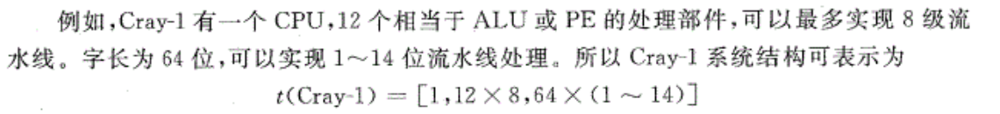
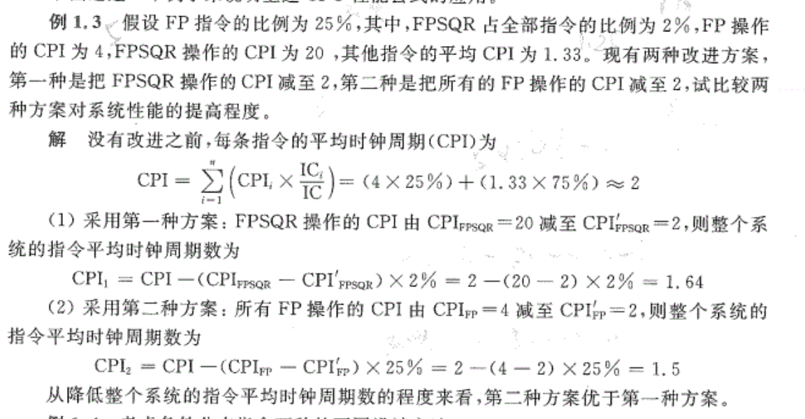
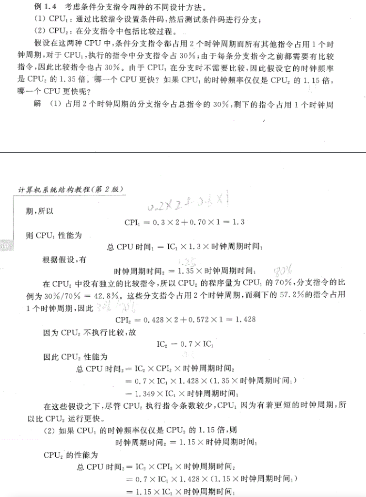

# 计算机系统结构基础知识

## 计算机系统的基本概念

### 计算机系统的层次结构

* 物理机：用固件/硬件实现的机器
    * 固件：具有软件功能的硬件
* 虚拟机：由软件实现的机器
* 各机器级的实现主要靠翻译或解释
    * 翻译：先用转换程序把高一级机器上的程序转换成低一级机器上的等效程序，然后在这低一级机器上运行
    * 解释：对于高一级程序上的每一条指令都转去执行低一级机器上的一段等效程序，执行完在取下一条指令
    * 解释执行花费时间更多，但占用内存更少

从计算机语言的角度，把计算机系统按功能划分为多级层次结构：

* 第一级：微程序机器（物理机）
* 第二级：传统机器语言机器（物理机）
* 第三级：操作系统虚拟机
* 第四级：汇编语言虚拟机
* 第五级：高级语言虚拟机
* 第六级：应用语言虚拟机
 
 ### 计算机系统结构的定义

 * 计算机系统结构的经典定义：传统机器程序员所看到的的计算机属性，即概念型结构和功能特性
 * 按照计算机的多级层次结构，不同级程序员所看到的的计算机具有不同属性。(透明性)低层计算机属性对于高级计算机的程序员时“看不见”的
 * 广义的系统结构定义：指令系统结构、组成、硬件
 * 计算机系统结构的实质：确定计算机系统中软硬件的界面，界面之上时软件实现的功能，界面之下时硬件实现的功能

### 计算机组成和计算机实现

* 计算机系统结构：计算机系统软硬件的界面
* 计算机组成：计算机系统结构的逻辑实现。着眼于物理机器级内各事件的排序方式与控制方式、各部件功能以及各部件之间的联系
* 计算机实现：计算机组成的物理实现。着眼于器件技术、微组装技术
* 具有相同计算机系统结构的计算机可以采用不同的计算机组成，同一种计算机组成又可以采用多种不同的计算机实现
* 系列机：由同一厂商生产的具有相同计算机系统结构、但具有不同组成和实现的一列不同型号的机器

### 计算机系统结构的分类

* Flynn分类法：按照数据流和指令流的多倍性（同时处于同一执行阶段的指令或数据的最大数目）进行划分
  * 单指令单数据流(SISD)
  * 单指令多数据流(SIMD)
  * 多指令单数据流(MISD)
  * 多指令多数据流(MIMD)
* 冯氏分类法：用系统的最大并行度(计算机系统在单位时间内能够处理的最大二进制位数)对计算机进行分类
    * 字串位串
    * 字串位并
    * 字并位串
    * 字并位并
> 平均并行度：假设每个时钟周期内能同时处理的二进制位数为$P_i$，则T个时钟周期内的平均并行度为：
$$P_a = \frac{\sum \limits_{i=1}^{T}P_i}{T}$$

> 平均利用率：系统在T个时钟周期内的平均利用率定义为：
$$\mu = \frac{P_a}{P_m} = \frac{\sum \limits_{i=1}^{T}P_i}{TP_m}$$
* Handle分类法：根据并行度和流水线对计算机进行分类
    * t(系统型号) = (k $\times$ k', d$\times$d', w$\times$w')
      * 程序控制部件（PCU）的个数k
      * 算数逻辑部件（ALU）或处理部件（PE）的个数d
      * 每个算数逻辑部件包含基本逻辑线路（ELC）的套数w
      * 宏流水线中程序控制部件的个数
      * 指令流水线中算数逻辑部件的个数
      * 操作流水线中基本逻辑线路的套数
      * 例：

## 计算机系统的设计

### 计算机系统设计的定量原理

* 以经常性事件为重点
* Amdahl 定律
  * 系统加速比 S$_n$ = $总执行时间_{改进前} / 总执行时间_{改进后}$
    $$S_n = \frac{T_0}{T_1} = \frac{1}{(1-Fe) + \frac{Fe}{Se}}$$
    其中，Fe 为可改进比例，Se 为部件加速比
  * 一种性能改进的递减规则：如果只对一部分做改进，改进的性能比例越大，改进的效果越小。所获加速比不超过 $1/(1-Fe)$
* CPU 性能公式：IC 为指令数
  * 每条指令执行的平均时间周期数 CPI = $总时钟周期数 / IC $ = $\sum \limits_{i=1}^{n}{(CPI_i \times \frac{IC_i}{IC})}$，$\frac{IC_i}{IC}$ 为第 i 条指令所占的比例   
  * CPU时间 = $CPI \times IC \times 时间周期时间$ = $\sum \limits_{i=1}^{n}{(CPI_i \times IC_i)} \times 时间周期时间$
  * 例：
* 程序局部性原理：；程序所访问的存储器地址往往相对集中
  * 时间局部性：程序即将用到的信息往往是最近刚用过的信息
  * 空间局部性：程序即将用到的信息往往是最近刚用过的信息所在或邻近的存储单元

### 计算机系统设计者的主要任务

* 任务包括：
  * 指令系统的设计
  * 数据表示的设计
  * 功能的组织
  * 逻辑设计
  * 物理实现
* 工作包括：
  * 确定用户对计算机系统的功能、价格和性能的要求
  * 软硬件功能分配
  * 设计生命周期长的系统结构
  
### 计算机系统结构设计的主要方法

* 由上往下设计：使用专用机设计，不适用通用机
* 由下往上设计：软件技术完全被动，造成软硬件脱节，使整个系统效率降低
* 从中间往下设计

## 计算机系统的性能评测

* 执行时间（执行单个程序的时间）和吞吐率（单位时间内执行的程序数）
  * CPU时间：用户CPU时间 + 系统CPU时间
* 基准测试程序
  * 真实程序
  * 核心测试程序（核心测试程序是真实程序的子集，它们包含了真实程序的核心功能）
  * 小测试程序（简单几十行的小程序）
  * 合成的测试程序（由多个小测试程序组合而成）
  * 基准测试程序套件：由多个真实程序组合而成
* 性能比较
  * 总执行时间
  * 平均执行时间在：$S_m = \frac{1}{n} \sum \limits_{i=1}^{n}{T_i}$，其中，$T_i$ 为第 i 个程序的执行时间
  * 加权执行时间：$A_m = {\sum \limits_{i=1}^{n}{T_i \times W_i}}$，其中，$W_i$ 为第 i 个程序的权重
  * 调和平均值法（一般在性能用速度表示时使用）：$H_m = \frac{n}{\sum \limits_{i=1}^{n}{\frac{1}{R_i}}}$，其中，$R_i$ 为第 i 个程序的速度
  * 几何平均执法：$C_m = \sqrt[n]{\prod \limits_{i=1}^{n}{T_i}}$

## 计算机系统结构的发展

### 冯诺依曼结构及其改进

* 存储程序原理的基本点：指令驱动
* 特点
  * 以运算器为中心
  * 存储器中，指令和数据同等对待
  * 存储器按地址访问、按顺序线性编址，每个单元位数固定
  * 指令执行时顺序的
  * 指令由操作码和地址码组成
  * 指令和数据均以二进制编码表示
* 改进
  * 输入输出改进：例程序等待、程序中断、DMA、通道等
  * 并行技术改进
  * 存储结构改进：例通用寄存器、cache
  * 指令系统发展：复杂指令集计算机（CISC）和精简指令集计算机（RISC）

### 软件对系统结构的影响

* 软件移植行问题
  * 统一高级语言
  * 系列机：同一厂家生产具有相同系统结构，但组成和实现不同
    * 向上（下）兼容：程序能不加修改的运行在高（低）档的机器上
    * 向前（后）兼容：程序能不加修改的运行在之前（后）投入市场的机器上
    * 向后兼容是系列机的根本特征
    * 兼容机：不同厂家生产的具有相同系统结构的机器
  * 模拟：用本机（宿主机）机器语言解释执行另一台机器（虚拟机）的机器语言程序。运行缓慢
  * 仿真：用本机上的微程序解释执行另一台机器的机器语言程序。只能在系统结构差距不大的机器间使用
  
### 器件发展对系统结构的影响

* 推动计算机系统结构发展的最活跃因素
* 摩尔定律：集成电路上可容纳的晶体管数目每隔 18 个月就会增加一倍

### 应用对系统结构的影响

应用需求时促使系统结构发展的最根本动力

## 计算机系统结构中并行性的发展

* 并行性（parallelism）：计算机在同一时刻或同一时间间隔内进行多种运算或操作
  * 同时性（simultaneity）：同一时刻
  * 并发性（concurrency）：同一时间间隔
* 从处理数据角度
  * 字串位串
  * 字串位并
  * 字并位串
  * 全并行
* 从执行程序角度
  * 指令内部并行
  * 指令级并行
  * 线程级并行
  * 任务级或过程级并行
  * 作业或程序级并行

### 提高并行性技术

* 时间重叠：多个处理过程在轮流重叠的使用同一套硬件的各个部分
* 资源重复：重复设置硬件资源
* 资源共享：多个任务按一定时间顺序轮流使用同一套硬件设备
  
### 多机系统并行性发展

* 紧密耦合系统：各个机器之间的通信是通过总线实现的
* 松散耦合系统：各个机器之间的通信是通过专门的通信线路实现的
* 异构型系统：由多个不同类型，担负不同功能的处理机组成
* 同构型系统：由多个相同类型，担负相同功能的处理机组成