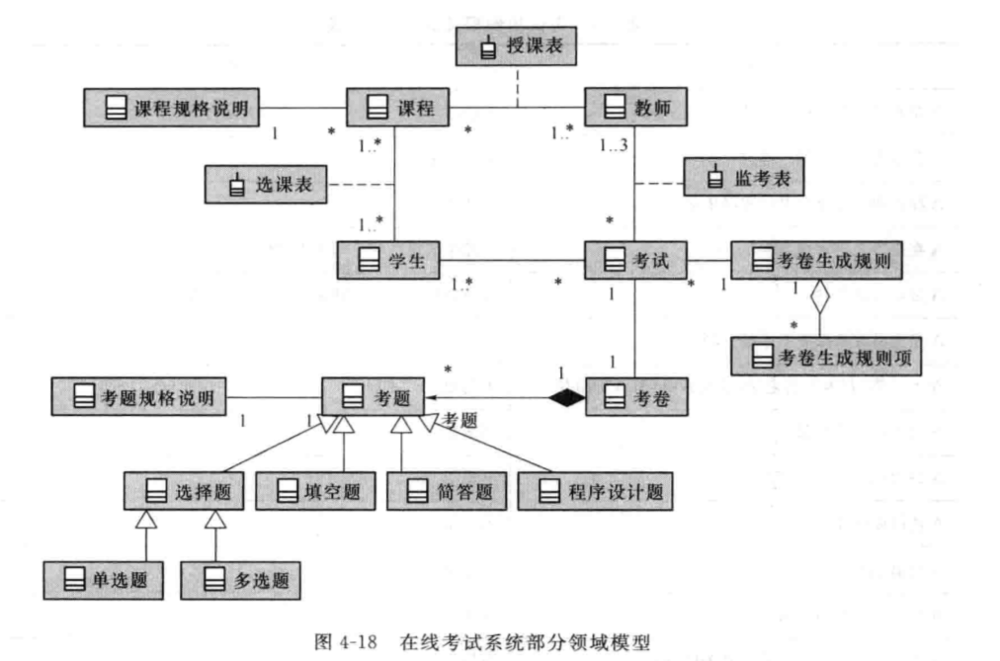
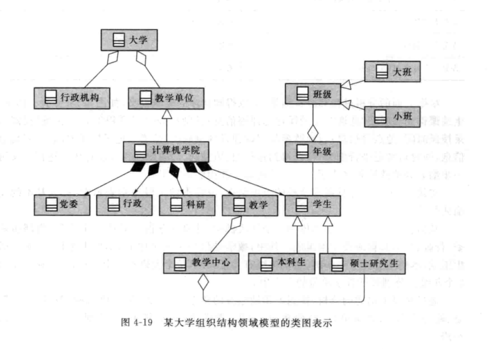

# 面向对象的需求分析方法

## UML 4+1 视图和 9 个基本图

* 用例视图：强调从用户的角度看到的或需要的系统功能
  * 用例图:（从用户的角度）描述系统的功能
  * 活动图:描述了系统元素之间的活动
* 逻辑视图：展现系统的静态或结构组成及特征
  * 类图：描述系统的静态结构（类及其相互关系）
  * 对象图：描述系统在某个时刻的静态结构（对象及其相互关系）
  * 顺序图：按时间顺序描述系统元素间的交互
  * 协作图：按照时间和空间的顺序描述系统元素间的交互和它们之间的关系
* 进程视图：描述设计的并发和同步等特性，关注系统非功能性需求
  * 状态图：描述了系统元素（对象）的状态条件和响应
  * 活动图：描述了系统元素之间的活动
* 构建视图：关注软件代码的静态组织与管理
  * 构件图：描述了实现系统的元素（类或包）组织
* 部署视图：描述硬件的拓扑结构以及软件和硬件的映射问题
  * 部署图：描述了环境元素的配置并把实现系统的元素映射到配置上

## 领域模型

针对某一特定领域内概念类或者对象的抽象可视化表示

表示了需求分析阶段**当前模型**逻辑模型的静态结构以及业务流程。主要用于概括地描述业务背景及重要的业务流程

### 创建步骤

* 找需求中找出候选概念类
* 在领域模型中对概念类进行命名
* 在概念类之间添加关系
* 在概念类内添加属性

> 一般来说，领域模型中的概念类都是**名词**，而关系则是**动词**
> 名词既可以是概念类，也可以是属性

### 类图

#### 类的组成

* 类名
* 属性（可选）
* 操作（可选）
 
#### 关系

从弱到强依次是：

* 依赖
    
  * 类 A 把类 B 的实例作为方法里的参数
  * 类 A 的某个方法使用类 B 作为局部变量
  * 类 A 调用了 类 B 的静态方法
* 关联
    
  * 类 A 可以将类 B 的**某些属性**或类**对象**的整体作为自己的属性（不可修改）
* 聚合
    
  * 类 A 拥有类 B 的**整体**（可以修改），但是类 B 的生命周期不受类 A 的影响，即类 B 不会因为类 A 的消亡而消亡，可以被其他类分享
* 组合
    
  * 类 A 完全拥有类 B 的**整体**，类 B 会因为类 A 的消亡而消亡，且不可以被其他类分享
* 继承
    
  * 类 B 继承类 A
* 关联类
    
    * 包含关于关联有价值的信息

#### 案例

## 用例模型

以用例为核心从使用者的角度描述和解释待构建系统的功能需求

**目标系统**的逻辑模型，定义了目标系统的需求

### 用例图

#### 组成

* Actor：称为角色或者参与者，表示使用系统的对象，代表角色的不一定是人，也可以是组织、系统或设备；
* Use_case：称为用例，描述角色如何使用系统功能实现需求目标的一组成功场景和一系列失败场景的集合；
  * 基本用例：与角色直接相关的用例，表示系统的功能需求
  * 子用例：通过场景描述分析归纳出的用例，也表示了系统的功能，但这些用例与角色无直接关系，而与基本用例存在关联关系
    * 包含子用例：基本用例中必须执行的步骤
        
    * 扩展子用例：基本用例中可选执行的步骤
        
* Association：表示角色与用例之间的关系，以及用例和子用例之间的关系

#### 常见误区

* 非目的性用例：例如系统登录或密码验证并非业务层面的而用户直接需求，应当作为包含子用例
* 系统操作性用例：例如数据库连接、数据库通信并非系统使用者角度的需求，不必作为基本用例或子用例
* 用例表示的粒度：例如某类表单的增删查改完全可以合并为管理这一个基本用例

#### 案例

### 用例说明

### 系统顺序图

描述一个用例中角色与系统之间的消息交互形式

系统顺序图上需要明确消息的名称和参数

#### 特殊模块

* 引用：为一些使用评率高的子用例创建一个模块，以便在用例中重复使用
* 循环：用于描述循环操作
* 可选：用于描述扩展子用例

#### 案例

### 操作契约

操作契约为系统操作（处理系统事件的操作）而定义，为软件的结构设计提供必要信息

